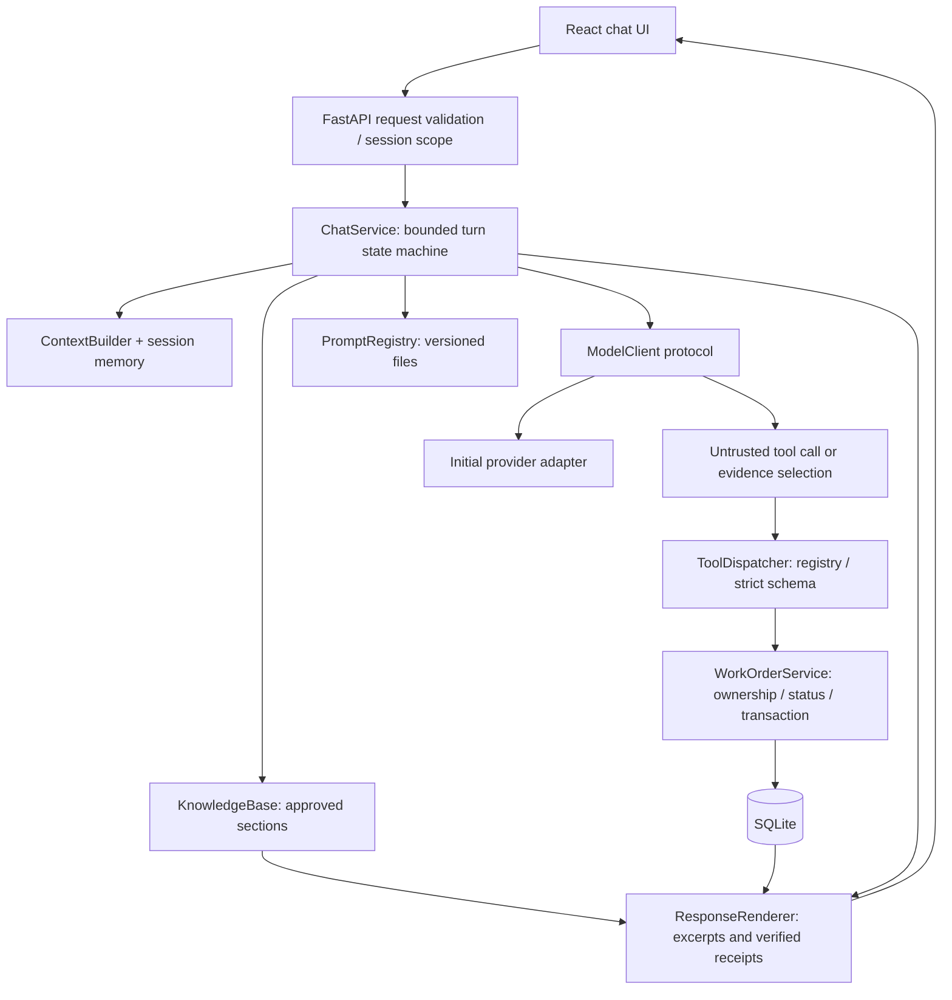
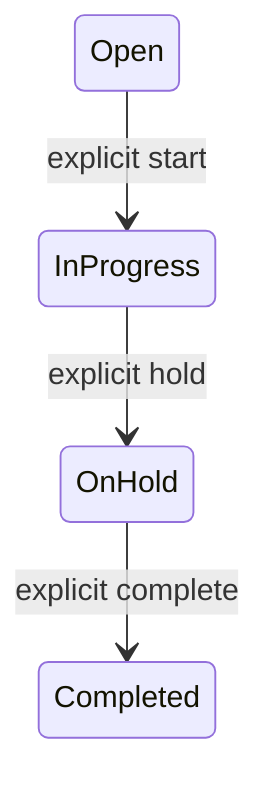
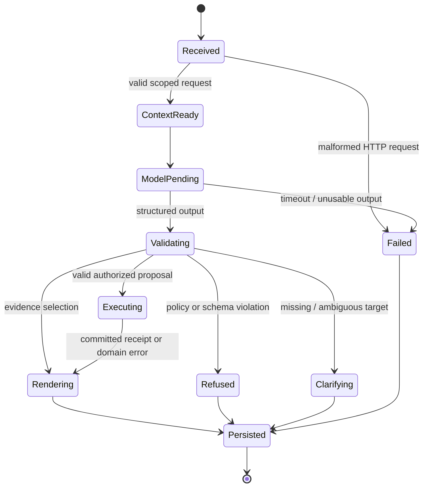

# Field technician assistant — implementation plan

> **Status (29 Sep 2026): implemented.** This was the pre-build plan. The running system follows it except for the deltas in [docs/EVALUATION.md §4](docs/EVALUATION.md) and decisions D41–D52 in [docs/decision-log.md](docs/decision-log.md). The current system map is [docs/architecture.md](docs/architecture.md). Checklist evidence: [docs/validation.md](docs/validation.md).

Status: **design and implementation instructions, not a runnable application**. Prepared for Zeel Rathi, 28 September 2026. The PDF asks for working software; this package plans that software and defines the evidence needed before it can be submitted. Do not describe planned tests as passing tests.

## 1. Outcome and scope

Build a Python backend with a minimal React chat UI. A technician can ask maintenance questions, inspect an owned work order, update its status, add a note, and flag it for supervisor review. Replies must be supported by the supplied knowledge base or authoritative work-order results. Session context makes “mark it complete” refer to the previously discussed, unambiguous work order.

The LLM interprets language and proposes calls. Backend code decides whether a call is allowed; the database records what actually happened. No prompt, model response, work-order note, or conversation summary can grant permission.

**Source hierarchy:** the user's request defines this planning task. ASSIGNMENT.pdf supplies product and submission requirements. `inputs/knowledge.md` is answer evidence, not executable instructions. `inputs/work_orders.json` is immutable seed data; its `currentUser` is the assessment principal. External documentation explains APIs, not business policy. The assignment PDF has been read in full and is deliberately not copied into this package; keep assessment materials in the authorized assessment workflow.

### Required by the PDF

| ID | Requirement | Implementation boundary | Verification |
|---|---|---|---|
| R1 | Python backend; minimal React UI | FastAPI; React + TypeScript | Launch and browser smoke |
| R2 | Answers grounded in knowledge.md; abstain if absent | KnowledgeBase + ResponseRenderer | Covered, uncovered, mixed, and misleading-topic tests |
| R3 | LLM selects structured/tool calls for all four tools | ModelClient + ToolDispatcher | Native provider smoke plus fake-model contract tests |
| R4 | Only assigned work orders | WorkOrderService for reads and writes | Other-tech cases on every tool |
| R5 | Strict adjacent status flow | StatusPolicy + transactional update | All 16 source/target pairs |
| R6 | Reject unknown tools and malformed arguments | Static registry + strict validation | Invalid name, enum, type, keys, size tests |
| R7 | Context across turns | SessionRepository + ContextBuilder | Explicit ID, pronoun, ambiguity, isolation, restart |
| R8 | Short DECISIONS.md with three answers | Root DECISIONS.md | Human review; about half a page |
| R9 | Repository or zip with backend/frontend | Delivery checklist | Clean archive/clone contains running app |
| R10 | One-command launch; README; key in env | Docker Compose + settings | Clean launch after documented key setup |
| R11 | Transparency about AI assistance | README + AI_USAGE.md | State what was generated and checked |

### Additional user requirements

OOP with small focused classes; model wrappers; prompt registry; bounded context; explicit memory and state machines; configuration, logging, data guidelines; rationale records; git authorship as Zeel Rathi; feature branches and PRs; parallel development with shared architectural context; HTML explanation; small-user efficiency and an honest growth path. These are design requirements, not excuses to add a runtime multi-agent framework.

### Intentional limits

One backend process, one local SQLite database, four business tools, one provider adapter initially, one compact chat screen. No vector database, autonomous planning agents, browser/shell tool, background auto-actions, fine-tuning, microservices, Redis, or Kubernetes. No claim of production multi-tenant authentication: the assessment uses its supplied user. Do not expose fixture-user mode publicly.

## 2. Architecture and ownership



| Component | Owns | Must not do |
|---|---|---|
| API routes | HTTP schema, request IDs, principal/session binding, error mapping | Put domain rules in route handlers |
| ChatService | Bounded orchestration, state transitions, event ordering | Bypass dispatcher; execute arbitrary names |
| ModelClient protocol | Neutral messages, tool calls, usage, capability limits | Store business truth or authorize users |
| Provider adapter | SDK request/response translation and tool-call correlation | Leak SDK types into domain classes |
| PromptRegistry | Load validated immutable prompt versions at startup | Accept user-selected prompt paths or live prompt writes |
| KnowledgeBase | Parse headings, retrieve/cite sections, content hash | Interpret reference text as commands |
| ContextBuilder | Select bounded history, focus and evidence | Promote a summary or stale status into truth |
| ToolDispatcher | Four-name allowlist and strict per-tool argument models | eval, exec, getattr-based arbitrary dispatch |
| WorkOrderService | Principal-aware operations and business invariants | Trust model-provided identity or cached authorization |
| SQLiteRepository | Short atomic transactions, version checks, persistence | Hold write locks while awaiting the model |
| ResponseRenderer | Source sections, policy messages, authoritative receipts | Display unchecked model prose as factual answers |

Use Python `Protocol` for the model/repository seams, typed dataclasses for internal value objects, and Pydantic for external input contracts. Prefer composition and constructor injection. Avoid one abstract base class per file, deep inheritance, global mutable sessions, and service-locator patterns. Domain policy is a pure function and can be tested without HTTP or a model.

## 3. Answering without inventing facts

The corpus is five short sections (~2.5 KB). Split on level-two headings, retain the entire section including cautions, assign stable IDs (`kb-1` through `kb-5`), and store a SHA-256 content version. Initially provide **all five sections** within the evidence budget: this is simpler and avoids keyword retrieval misses at this scale. The retrieval interface still supports a scored subset later. Never use work-order task descriptions as evidence for new maintenance instructions.

The model returns structured evidence selection: coverage (`supported`, `partial`, `unsupported`, `clarify`), section IDs, and missing question spans. The backend renders the **exact complete approved section(s)** with their headings. If no evidence applies, use “The provided knowledge base does not cover that question.” For partial coverage, render the supported sections and explicitly label the uncovered question text. Missing spans must be literal substrings of the user's question; reject fabricated spans. For ambiguous questions use a fixed clarification template.

This deliberately favors traceable excerpts over elegant paraphrases. Valid section IDs and exact source text stop invented technical claims from entering the response. They do **not** prove that the chosen section answers the question: relevance still requires conservative model instructions and adversarial evaluation. A thermostat firmware question must abstain even though WO-008 mentions firmware; a refrigerant pressure target is not supplied just because WO-001 has a pressure-check step. Do not market probabilistic relevance as a mathematical guarantee.

Preserve entire safety sections; do not quote only the convenient sentence while omitting a limit. For a servicing/reset/filter procedure, append the full lockout/tagout section once as a conservative documented accompaniment. A request to bypass someone else's lockout returns the approved lockout guidance, not a novel workaround. No web search or general-model fallback in runtime answers. Warranty eligibility cannot be calculated from a due date; missing installation date/history/serial data must be acknowledged.

Work-order answers are a separate factual source: render only allowlisted fields from an authorized `get_work_order` result with ID and version. Label a work-order `steps` list as recorded tasks, not verified procedural advice. Status changes, notes, and escalations are reported from persisted tool receipts. Free-form model final text is discarded.

## 4. Tool execution and the status invariant

Exact tool schemas, result envelopes, and API contracts are in [contracts](docs/contracts.md). All four tools run through the same dispatcher. The provider's schema mode improves formatting; server validation and business checks remain mandatory.

For every operation: validate name → decode JSON → strict argument schema → resolve and bind target → load fresh record → ownership check → business preconditions → atomic operation/result → deterministic receipt. Identity comes from the trusted backend principal, never tool arguments. Refuse nonexistent and inaccessible IDs with the same public error.

The status graph is exactly:



No backward transition, shortcut, or same-state update is accepted. Completed is terminal for **status changes**; the PDF does not prohibit notes/escalations on completed work, so allow them subject to ownership. A duplicate request ID returns its previous receipt, which is distinct from a new same-state request.

Allow at most one mutating call per user turn. Reject a multi-mutation batch before executing any of it. Do not transform “complete” into a series of intermediate transitions. Ask the user to issue batch work as separate requests. A successful read may precede a mutation, but it never relaxes the later checks. A referenced procedure is not permission to auto-escalate. `escalate` adds a local supervisor flag/reason; it does not send a notification or change status.

Explicit, unambiguous user action requests execute after backend checks without a generic confirmation round trip. Ambiguous IDs, conflicting references, absent note/reason, and unclear action intent require clarification. A deterministic conservative IntentGuard binds explicit supported action phrasing to its exact status/payload; unsupported, negated, quoted or compound phrasing clarifies. For target binding, the accepted explicit ID or session focus is determined by server state; a model-proposed different ID is rejected. Natural-language intent is not a perfect security classifier; the invariant guarantee is the deterministic ownership/status/schema boundary. Narrow scope and refusal tests reduce unintended-action risk.

## 5. Turn lifecycle, memory, and context



This is a **turn state machine**, independent of work-order status. A read can loop back to ModelPending once with its correlated tool result if needed. Maximum two model decisions per turn, two tool invocations total, and one mutation total. End after a mutation using a deterministic receipt; no model follow-up is needed to invent a success message. Invalid calls terminate safely, without a repair loop that might rewrite user intent.

Persist session focus, unresolved candidates, pending clarification, recent turns and authoritative receipts in SQLite. Store user ID on each session. An active work-order ID survives history truncation and restart; an active status does not become truth and must be reloaded. “Show WO-003” then “mark it complete” succeeds. “Compare WO-001 and WO-003” then “complete it” asks which. A refused foreign ID clears action focus and cannot fall back to an old owned ID. See [memory and prompts](docs/memory-and-prompts.md) for complete update rules and budgeting.

## 6. Target repository layout

The following files are implementation targets, not files already implemented in this planning package:

```text
backend/
  pyproject.toml, uv.lock, Dockerfile
  app/
    main.py                 # app factory, lifespan, route wiring
    config.py               # validated env settings
    api.py                  # HTTP request/response models and routes
    domain.py               # entities, statuses, errors, pure policies
    repository.py           # SQLite schema, transactions, sessions, receipts
    tools.py                # strict args, schemas, dispatcher, service
    agent.py                # ChatService and finite bounded orchestration
    memory.py               # ContextBuilder, focus update, budget
    knowledge.py            # load, version, section selection, renderer
    models.py               # protocol + normalized model DTOs
    providers/openai.py     # first SDK adapter only
    prompts/registry.py
    prompts/v1/system.txt
    prompts/v1/evidence.txt
  tests/                    # policy, tool, session, HTTP, provider-contract tests
frontend/
  package.json, package-lock.json, tsconfig.json, vite.config.ts
  src/App.tsx, src/api.ts, src/types.ts, src/main.tsx
compose.yaml
.env.example
inputs/knowledge.md, inputs/work_orders.json
README.md, DECISIONS.md, AGENTS.md, AI_USAGE.md
```

Files may be combined if simpler, but contracts and dependencies must remain clear. Keep the domain framework-independent. Only split files when they have independent responsibility or become difficult to review.

## 7. Implementation sequence and parallel work

| Phase | Owner / branch | Work and dependency | Exit evidence |
|---|---|---|---|
| P0 — contracts | Integrator / `docs/contracts` | Read all sources; freeze tool/API/memory contracts and fixture hash | Conflicts resolved; source-to-test matrix reviewed |
| P1 — policy/data | Backend agent / `feat/domain-tools` | Pure policy, strict schemas, SQLite seed/transactions/receipts | All status pairs, ownership on all tools, atomicity/idempotency tests pass |
| P2 — model/context | Agent engineer / `feat/agent-loop` | Depend on P0; fake provider, prompt registry, KB rendering, memory, native adapter | Bounded loop, injection, unknown KB, context tests pass |
| P3 — UI/run | Frontend agent / `feat/chat-ui` | Depend on P0; typed mock API until P1/P2 integrate; Compose/package locks | Empty/loading/error/retry/new-chat UI and build pass |
| P4 — integration | Integrator / `feat/integration` | Merge P1/P2/P3 through PRs; wire actual API and DB | End-to-end fixture scenarios; one-command launch |
| P5 — handoff | Reviewer / `docs/submission` | Live model smoke, clean clone, honest docs, private delivery | All required deliverables complete; no secrets; author verified |

P1, P2, and P3 can run in parallel after P0. Every agent reads `AGENTS.md`, this plan, contracts, memory, guardrails, and test matrix first. Give each agent explicit file ownership and the same non-negotiable policy summary. Integrator alone changes shared contracts, dependency locks, and composition wiring; communicate contract changes before dependent edits. Agents must not independently loosen a rule to make their own tests pass.

Assessment core is designed to fit the PDF's approximate 2–3-hour scope for an experienced implementer; provider setup/debugging and this expanded documentation may take longer. Timebox optional improvements. Build the simple complete vertical slice before optional hardening. Do not sacrifice any required guardrail to meet a time estimate.

## 8. Quality, efficiency, and scale

Optimize in this order: rule correctness → groundedness → successful task completion → understandable code → reliability → token/latency/cost → optional UX. Reject an optimization if it changes any safety test result.

Start with one model decision for KB responses or direct calls; permit a second only for a needed read-result follow-up. Render successful writes without a second model pass. Load the five KB sections once, reuse a stable prompt prefix, cache static schemas by version, and keep history bounded. Do not cache authorization, current status, or mutation decisions. Provider/model are configuration; selecting another model requires the same conformance evaluation. Choose the cheapest available model that meets the quality gates, not an assumed cheapest model name.

Record input/output tokens, model calls, end-to-end latency, policy failures, abstentions, DB contention, and session conflicts. Initial **targets, not measured results**: zero invariant violations; zero fabricated claims in the gold suite; all required scenarios pass; at most two model calls/turn; no duplicate mutation under retries; five simultaneous test sessions without crossed context. Report p50/p95 latency and token usage with hardware/model/date rather than promising a provider-independent speed or cost.

Use SQLite on one local persistent disk and one worker for the assessment. Short transactions permit a small number of users; serialize turns per session and bound global model concurrency to four by default. If multi-instance deployment is needed or write contention is material in measurements, replace only the repository/session serialization boundary with Postgres transaction/advisory-lock equivalents. Add real authentication before any shared deployment. Add better retrieval only when the KB no longer fits the evidence budget or evaluated recall worsens. Streaming is optional after correct receipts and cancellation behavior exist.

## 9. Completion checklist

- [ ] Working backend and minimal React UI committed under feature branches/PRs.
- [ ] Four genuine model-selected tools, with server-enforced ownership/status/schema guards.
- [ ] Grounded and abstaining answers, cross-turn focus, ambiguity handling, session isolation.
- [ ] Immutable supplied fixtures, persisted notes/escalations, transaction and restart checks.
- [ ] `docker compose up --build` works after documented `.env` setup in a clean checkout.
- [ ] Fake-model suite passes; real-provider smoke explicitly recorded or clearly blocked by missing credentials.
- [ ] README updated from plan status to actual tested commands; short DECISIONS.md written in accurate past tense.
- [ ] AI assistance disclosed; full rationale in separate decision log; HTML guide consistent with implementation.
- [ ] No secrets, runtime DB, transcript logs, PDF, dependency folders, or generated caches in submission.
- [ ] All commit author/committer names are Zeel Rathi; user-provided verified email used.
- [ ] Private reviewer repository or zip supplied; remote URL/visibility and authentication configured outside tracked files.

The plan package itself completes the planning request. It does not satisfy the PDF's running-software gate until these boxes have evidence.
