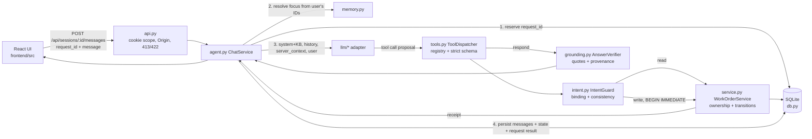

# Architecture and system map

Implemented design (29 Sep 2026). For exact API/tool/limit names see `docs/contracts.md`; for the
reasoning behind choices see `DECISIONS.md` and `docs/decision-log.md`.

## Request flow

Turn limits: ≤3 model calls (one transient retry counted), ≤3 tool calls, ≤1 mutation; a mutation ends
the turn. The model finishes every non-mutating turn with the `respond` tool.

## Where to change what

| Change | File(s) | Tests to extend |
|---|---|---|
| Status rules / ownership | `backend/app/domain.py`, `service.py` | `tests/test_domain.py`, `test_service.py` |
| Tool schemas / limits | `backend/app/tools.py`, `config.py` | `tests/test_tools.py`, adapter tests |
| When a proposal counts as "asked for" | `backend/app/intent.py` | `tests/test_intent.py`, `test_scenarios.py` |
| What counts as a grounded answer | `backend/app/grounding.py` | `tests/test_grounding.py`, scenarios S08–S13 |
| Conversation focus / history window | `backend/app/memory.py` | scenarios R13, R14, S02–S04, S14, S15 |
| Turn loop, budgets, idempotency | `backend/app/agent.py` | scenarios S16–S23, C05, C06 |
| Prompt | `backend/app/prompts/v1/system.txt` | scenarios + `make smoke` |
| New LLM provider | `backend/app/llm/<name>.py`, `llm/factory.py`, `config.py` | `tests/test_adapters.py` |
| HTTP surface | `backend/app/api.py`, `main.py` | `tests/test_api.py` |
| UI | `frontend/src/**` | `e2e/test_browser.py` |
| Packaging | `Dockerfile`, `compose.yaml`, `Makefile` | `docker compose up --build` |
| Agent workflow | `AGENTS.md`, `tools/agentctl.py`, `.agents/**` | `tools/tests/test_agentctl.py` |

## State

| State | Where | Authority |
|---|---|---|
| Work orders, notes, escalations, audit | SQLite `work_orders`, `notes`, `escalations`, `audit_events` | Truth, re-read every call |
| Session focus, candidates, pending clarification | `sessions` | Reference only |
| Transcript | `messages` (display text + sources/cards/receipts) | History for context, never authority |
| Idempotency | `requests` (processing/completed/interrupted + response JSON) | Replay/conflict |
| Seed | `inputs/work_orders.json` (immutable; hash pinned in `schema_meta`) | Used once on empty DB |
| Knowledge | `inputs/knowledge.md` → `kb-1..kb-5` | Only source for maintenance facts |

## Providers

`MODEL_PROVIDER=openai` (any OpenAI-compatible base URL: OpenAI, Gemini, Groq, OpenRouter, Together,
DeepSeek, Mistral, Ollama, vLLM), `anthropic` (native), `offline` (deterministic heuristic, **not an LLM**,
used for tests/e2e/keyless demo and labelled in the UI). All share `ModelClient.generate()`.
