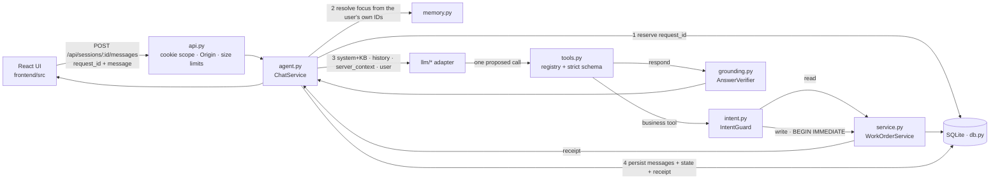

# Architecture

One FastAPI process serves the React build and a small JSON API, with one SQLite file. The LLM sits behind a provider-neutral interface and can only propose tool calls. Every proposal goes through the same checks before anything is read or written.

## Request flow

## One turn

1. **Reserve** the `(user, session, request_id)` row. An exact retry replays the stored response, the same ID with different text returns 409, and one still running returns 202. The session is locked for the whole turn, so a second message sent meanwhile gets 409.
2. **Resolve focus deterministically** from the work-order IDs in the technician's text:
   - one ID they own → it becomes the focus;
   - one ID that is foreign or missing → focus cleared;
   - several IDs → ambiguous;
   - none → keep the previous focus.
3. **Build context:**
   - system prompt plus all five knowledge-base sections (the stable prefix);
   - the last 8 messages / 12 000 chars of history, with receipts marked;
   - a `<server_context>` block: technician, active order, IDs in this message, and the technician's own order list;
   - the user's message.
4. **Call the model** with `tool_choice` set to required. It must call exactly one of `get_work_order`, `update_status`, `add_note`, `escalate` or `respond`.
5. **Handle the proposal:**
   - unknown name or bad arguments → refused;
   - a read → the order is checked for ownership, the result goes back to the model, and the loop continues;
   - a write → `IntentGuard`, then `WorkOrderService` inside `BEGIN IMMEDIATE`, then a receipt, and **the turn ends**;
   - `respond` → `AnswerVerifier` → rendered.
6. **Budgets:** ≤3 model calls (one transient retry counted), ≤3 tool calls, ≤1 write. Plain text with no tool call fails closed.
7. **Persist** the user message, the assistant message (with sources, cards and receipt), the session state and the stored response. For a write, this happens in the same transaction as the write itself.

## Modules

| File | Responsibility |
|---|---|
| `backend/app/domain.py` | Statuses, the three legal edges, error codes, `ToolResult`, seed validation |
| `backend/app/db.py` | Schema, one-time seed with pinned hash, short explicit transactions, `interrupted` recovery at startup |
| `backend/app/service.py` | The only code that touches work orders; ownership on every call |
| `backend/app/tools.py` | Five tool schemas and their strict Pydantic validators (the same source for both) |
| `backend/app/intent.py` | IntentGuard: is this the order and the change the technician asked for? |
| `backend/app/grounding.py` | AnswerVerifier: quotes, numbers, IDs, asset codes, dates, per-order status claims, no claimed actions |
| `backend/app/knowledge.py` | Knowledge sections `kb-1`…`kb-5`, hashes, verbatim-quote matching |
| `backend/app/memory.py` | Session state, focus resolution, history window, server context |
| `backend/app/agent.py` | The turn loop, idempotency, session locks, receipts |
| `backend/app/llm/` | `ModelClient` protocol with adapters: `openai_compat`, `gemini_native`, `offline`, `scripted` (tests) |
| `backend/app/prompts/v1/system.txt` | The only prompt, loaded through a versioned registry |
| `backend/app/api.py`, `main.py` | HTTP routes, browser-session cookie, Origin check, 64 KB body limit, SPA serving |
| `frontend/src/` | `App.tsx` (session, retries), `components/` (messages, composer, work-order panel) |

## Conversation memory

| State | Stored in | Authority |
|---|---|---|
| Work orders, notes, escalations, audit | SQLite | The truth, re-read on every call |
| Focus, candidate IDs, pending clarification | `sessions` | Only tells the assistant which order "it" means; never grants permission |
| Transcript | `messages` | Model context only |
| Request receipts | `requests` | Replay and conflict detection |

"It" is resolved by the server, never by the model:

- a mutation on a pronoun needs a focus set in an **earlier** turn;
- a model that targets a different ID is rejected;
- after a "which one?" clarification, a reply that is only an ID completes a status request whose target was missing, but never a note or escalation, and never on "yes".

## Providers

| `MODEL_PROVIDER` | Adapter | Tool forcing |
|---|---|---|
| `openai` (+ any OpenAI-compatible `MODEL_BASE_URL`) | `openai_compat.py` | `tool_choice="required"`, `parallel_tool_calls=false`, `strict` (dropped for `MODEL_COMPAT=generic`) |
| `gemini` | `gemini_native.py` | `functionCallingConfig.mode=ANY` + `allowedFunctionNames`; thought signatures replayed |
| `offline` | `offline.py` | Deterministic rules; labelled "not an LLM" |

SDK retries are disabled, so the turn budget owns retries. Adding a provider means an adapter, a factory branch, a `Settings` literal and contract tests.

## Scaling path

Today: one process, SQLite with WAL and `BEGIN IMMEDIATE` writes, per-session locks and a bounded model concurrency. That fits a small team on one host. Next steps, each only when needed:

- real authentication before anyone else can reach the app;
- Postgres with `SELECT … FOR UPDATE` when there are several instances or measured contention;
- streaming progress events.
